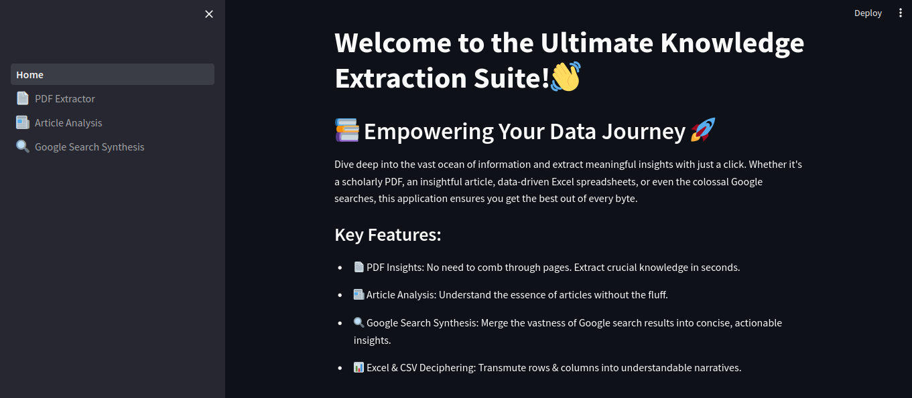

# QuestionAI: a QA & Summarization Tool built with LangChain

This application is your perfect first example to use LangChain framework and it's also intuitively designed to supercharge your content consumption. Whether you need instant answers from your personal PDFs, a summarized version of long articles, or the powerful assistance of a Google Search tool, this LangChain Agent powered app is your go-to tool.

## Features
- 📄 PDF Question Answering: Upload your personal PDFs and get concise answers to your queries, all without having to manually sift through the content.
- 📰 Web Article Summarization: Extract the essence of lengthy web articles in a concise format, making it easier to gather insights.
- 🔍 Google Search Integration: Extend your search capabilities with the integration of Google Search, offering the best of both personalized and web-based knowledge.

## Demo
[demo.webm](https://github.com/Azzedde/QuestionAI/assets/81826283/c5d019f7-ac48-486a-ac0a-e827e6279e56)

## Getting Started
### Installation
- Clone this repository:

      git clone https://github.com/Azzedde/QuestionAI.git

- Navigate to the project directory:

      cd LangChainAgent

- Install the required Python packages:

      pip install -r requirements.txt

### Running the Application

Once installed, you can run the Streamlit application with:

    streamlit run Home.py

This will launch the application in your default web browser. Follow the on-screen instructions to utilize the features.
## Usage

- PDF Question Answering:
    - Upload your PDF document.
    - Enter your question related to the content.
    - Get a concise answer almost instantly.

- Web Article Summarization:
    - Paste the link of the article you wish to summarize.
    - Wait for a few seconds as the tool processes the content.
    - Get a summarized version of the article.

- Google Search Integration:
    - Enter your query.
    - Get results directly from Google to help complement the information from your personal documents.

## Contributing

Contributions are what make the open-source community such an amazing place to learn, inspire, and create. Any contributions you make are greatly appreciated. Here's how you can contribute:
- Fork the Project
- Create your Feature Branch (git checkout -b feature/YourAmazingFeature)
- Commit your Changes (git commit -m 'Add some AmazingFeature')
- Push to the Branch (git push origin feature/YourAmazingFeature)
- Open a Pull Request

## Contact me
If you want to discuss you can find me here:

Project Link: https://github.com/Azzedde/QuestionAI

